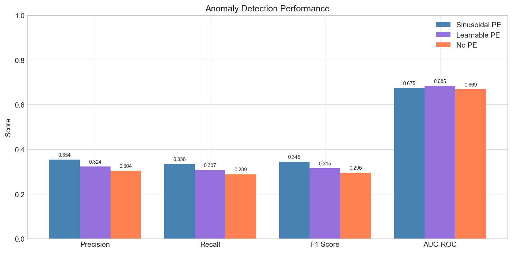
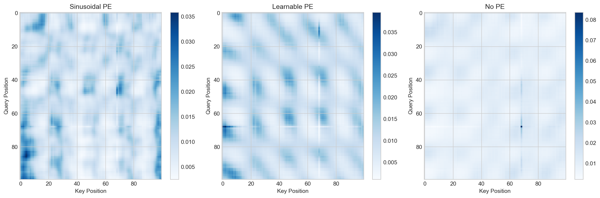
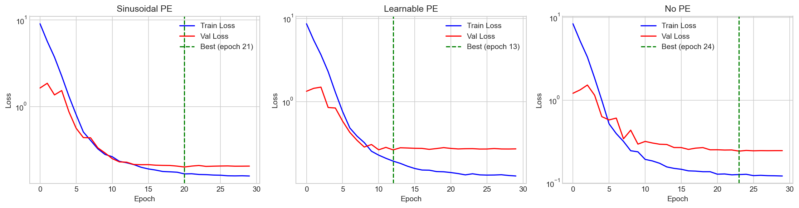
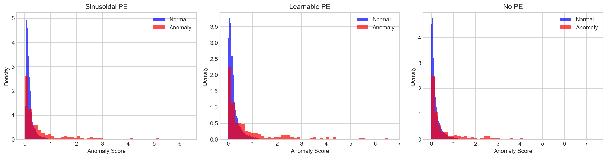

# Positional Encoding in Self-Attention for Time Series

A controlled experiment comparing self-attention **with and without positional encoding** on a time series anomaly detection task.

## Task

Build a time series model using self-attention. Compare results with positional encoding vs without, and explain why the outputs differ.

## Executive Summary

Self-attention with sinusoidal PE achieves ~16% higher F1 than without PE (0.345 vs 0.296). The key reason: self-attention is permutation equivariant—without PE, the model cannot distinguish position 5 from position 50. The hyperparameters that amplify this effect are d_model (more dimensions = finer position resolution), n_heads (each head can specialize in different positional patterns), and window_size (PE must uniquely encode all 100 positions).

## Approach

I built a transformer-based autoencoder for anomaly detection. The model reconstructs input sequences; reconstruction error = anomaly score. Anomaly detection via reconstruction is chosen because it naturally reveals whether the model understands position-dependent patterns—contextual anomalies can only be detected if the model knows "what value should appear at this position."

**Core comparison (as requested):**
1. **Sinusoidal PE** - fixed sin/cos encoding (Vaswani et al. 2017)
2. **No PE** - baseline without position information

**Additional variant (for deeper analysis):**
3. **Learnable PE** - trainable position embeddings, included to show why fixed PE outperforms learned PE in short training runs

## Why Outputs Differ: The Key Insight

The self-attention mechanism computes:

$$\text{Attention}(Q, K, V) = \text{softmax} \left( \frac{QK^T}{\sqrt{d_k}} \right) V$$

Where the Sinusoidal Positional Encoding is defined as:

$$PE_{(pos, 2i)} = \sin(pos / 10000^{2i/d_{model}})$$
$$PE_{(pos, 2i+1)} = \cos(pos / 10000^{2i/d_{model}})$$ 

Without any positional signal, vanilla self-attention is **permutation equivariant**: shuffle the input → the output shuffles the same way. That means the model cannot distinguish position 5 from position 50.

> Note: The permutation-equivariance statement holds for vanilla self-attention only when the model has no positional signal (no absolute PE, no relative-position bias), uses no causal/temporal mask, and is evaluated deterministically (e.g., `model.eval()` so dropout is off).  
> Under these conditions, permuting the input tokens permutes the outputs in the same way, so the model cannot inherently distinguish position 5 from position 50.


With PE added before the Q, K, V projections:
- Each position gets a unique signature
- Attention scores `QK^T` now encode position relationships
- The model can learn position-dependent dependencies such as lagged or periodic relationships (e.g., "current value depends on values at specific offsets").

**Permutation test supports this empirically**: shuffle input → reorder output → compare with original.
- No PE: difference ~1e-6 (equivariant, as expected)
- Sinusoidal PE: difference ~0.7 (position-dependent)
- Learnable PE: difference ~0.1 (weaker, needs training time)

---

## Results

### Anomaly Detection Performance



Sinusoidal PE achieves the best F1 (0.345) and precision/recall, followed by Learnable PE (0.315), then No PE (0.296). The ~16% relative F1 improvement from sinusoidal PE is consistent across all 3 runs with different seeds. AUC-ROC is similar across models (~0.67–0.68), while F1/precision/recall improve with PE. This suggests PE improves **score separation around a practical decision threshold** (cleaner normal vs anomaly distributions), but the **global ranking** of points changes less—so AUC moves only slightly.

Even without PE, performance is still non-trivial because ~40% of anomalies are point (20%) or collective (20%) and can be detected from value/shape cues. PE mainly boosts performance on the remaining ~60% contextual anomalies that require knowing *where* a value occurs in the sequence.

> Thresholding: I used a fixed 95th-percentile threshold (matching the ~5% anomaly ratio) to keep the comparison controlled across variants.  
> If we instead tune the threshold on a validation split, the absolute F1 values change, but the main conclusion remains the same: positional encoding consistently improves separation and yields higher F1 than no PE.


### Detailed Metrics (3 runs)

| Model Seed | Model | F1 | AUC-ROC | Precision | Recall |
|------------|-------|----|---------|-----------|--------|
| 42 | Sinusoidal PE | 0.3446 | 0.6751 | 0.3540 | 0.3357 |
| 42 | Learnable PE | 0.3151 | 0.6846 | 0.3237 | 0.3070 |
| 42 | No PE | 0.2963 | 0.6690 | 0.3044 | 0.2886 |
| 123 | Sinusoidal PE | 0.3495 | 0.6793 | 0.3591 | 0.3405 |
| 123 | Learnable PE | 0.3140 | 0.6798 | 0.3226 | 0.3059 |
| 123 | No PE | 0.3082 | 0.6723 | 0.3166 | 0.3002 |
| 456 | Sinusoidal PE | 0.3292 | 0.6701 | 0.3381 | 0.3207 |
| 456 | Learnable PE | 0.3139 | 0.6837 | 0.3225 | 0.3058 |
| 456 | No PE | 0.3067 | 0.6600 | 0.3151 | 0.2988 |

### Permutation Invariance Test

| Model Seed | Sinusoidal PE | Learnable PE | No PE |
|------------|---------------|--------------|-------|
| 42 | 0.8231 | 0.1077 | 0.0000010 |
| 123 | 0.6721 | 0.1286 | 0.0000010 |
| 456 | 0.6085 | 0.0913 | 0.0000010 |

Three distinct regimes:
- **No PE**: diff ~1e-6, permutation equivariant as expected
- **Learnable PE**: diff ~0.1, breaks symmetry but less strongly (Learnable PE starts from small random initialization and must be learned from data, so it may require more training (or different regularization) to converge to a clean position structure, hence a weaker symmetry-breaking signal in our 30-epoch runs)
- **Sinusoidal PE**: diff ~0.7, strongest symmetry breaking (fixed encoding from epoch 1)

---

## Analysis

### Attention Patterns



The attention heatmaps (first layer, first head) provide a qualitative illustration of how each model uses (or fails to use) positional information:

**Sinusoidal PE (left)**: Complex structured patterns with diagonal bands. The model appears to attend to specific relative positions; the structured bands suggest it is capturing lagged/periodic dependencies rather than treating all positions as interchangeable. Attention weights are distributed across many positions.

**Learnable PE (middle)**: Similar structure but noisier. The learned position embeddings haven't fully converged to optimal values in 30 epochs. Some periodic patterns are emerging but less pronounced.

**No PE (right)**: Nearly uniform attention (~0.01 everywhere) with one prominent vertical stripe. Without position information, the model cannot distinguish positions and tends to rely on content-only cues, often producing more position-agnostic attention. The vertical stripe suggests many queries focus on the same token/content feature regardless of their own positions.

### Positional Encoding Visualization


The sinusoidal PE structure explains why it works:

**Heatmap (top)**: Each row is a dimension, each column is a position. Lower dimensions (top rows) oscillate rapidly - they encode fine position differences. Higher dimensions oscillate slowly - they encode coarse position differences. Together, every position has a unique fingerprint.

**Dimension curves (bottom-left)**: Shows how individual dimensions vary with position. 
Lower-indexed dimensions (dim 0,1) oscillate rapidly with short periods, 
middle dimensions (dim 10,11) have intermediate periods, 
and higher dimensions (dim 30,31) oscillate very slowly. 
This multi-scale encoding lets the model represent both local and global position relationships.

**Cosine similarity (bottom-right)**: Positions close together have high similarity (yellow diagonal), positions far apart have low similarity (blue). The smooth gradient means the model can generalize - it learns "nearby positions are similar" without memorizing each position separately.

### Training Dynamics



Key observations:
- All models start from similar high loss (~10) and converge
- **Sinusoidal PE** achieves lowest final training loss, smooth convergence
- **Learnable PE** shows a "bump" around epoch 5-10 as it learns position representations
- **No PE** has highest validation loss plateau - it cannot fully reconstruct position-dependent patterns

Best epochs: Sinusoidal (21), Learnable (13), No PE (24). Learnable PE's early stopping at epoch 13 (vs. 21/24 for others) may indicate faster convergence followed by overfitting, possibly because the model has additional learnable parameters (the PE embeddings).

### Score Distributions



Reconstruction MSE distributions for normal (blue) vs anomaly (red) points:

- **Sinusoidal PE**: Best separation. Normal points cluster tightly at low MSE, anomalies have a longer tail extending to higher scores.
- **Learnable PE**: Similar pattern but more overlap in the 0.5-1.0 range.
- **No PE**: Most overlap between distributions. Without position awareness, contextual anomalies (normal values at wrong positions) get low reconstruction error.

---

### The Hyperparameters That Matter

The following hyperparameters determine how effectively PE breaks permutation symmetry:

- **d_model=64**: Sinusoidal PE uses multiple frequencies across dimensions. The fastest component changes with period ~`2π ≈ 6.28` steps, while the slowest varies much more slowly (for `d_model=64`, the slowest pair corresponds roughly to a scale `10000^(62/64) ≈ 7.5e3`, i.e., period ~`2π·7.5e3 ≈ 4.7e4` steps). This **multi-scale** signal gives each position a distinct signature. For our `window_size=100`, higher-frequency dimensions vary clearly within the window while lower-frequency dimensions change only slightly; together the multi-scale components still make positions distinguishable.

- **n_heads=4**: Each attention head can specialize in different position-dependent patterns. For example, one head might focus on short-range local context, while another specializes in longer-range or periodic offsets (i.e., specific relative lags). More heads = more diverse position relationships.

- **n_layers=2**: Stacking transformer layers lets the model combine position info with value info iteratively. Layer 1 might learn "attend to nearby positions", layer 2 can then learn "combine local patterns into global patterns". Deeper models can capture more complex position-dependent hierarchies.

- **window_size=100**: The sequence length fed to the model. PE must distinguish 100 positions. With `d_model=64`, the lowest-frequency dimensions have periods far larger than 100 (so they change only slightly within the window), while higher-frequency dimensions change noticeably; the combination across dimensions gives each position a unique multi-scale signature.

### Why Sinusoidal PE Shows the Strongest Effect

Sinusoidal PE provides a fixed, well-structured position signal from epoch 1. The model can use position information immediately without learning it.

Learnable PE starts from near-zero random values (initialized with std=0.02) and has to discover useful position representations during training. In 30 epochs, it partially learns position structure but hasn't fully converged - hence the weaker permutation test difference (~0.1 vs ~0.7).

No PE has no position information at all - the model is fundamentally limited to content-based attention.

---

## Experimental Design

- **Data seed fixed at 42**: Same training/test data across all runs. The same anomalies appear at the same positions every time.
- **Model seed varies (42, 123, 456)**: Only weight initialization and training batch order change.
- **60% contextual anomalies**: These are normal values appearing at wrong positions (e.g., a noon temperature at midnight). They can only be detected if the model knows position. This design maximizes PE's expected benefit.
- This setup isolates PE's effect from data variation.

### Data

Synthetic seasonal time series with 3 anomaly types:
- Point anomalies (20%): extreme values
- Contextual anomalies (60%): normal value at wrong position - **requires PE to detect**
- Collective anomalies (20%): level shifts

### Config

```
d_model=64, n_heads=4, n_layers=2, epochs=30, lr=0.001
window_size=100, train_length=10000, test_length=2000
anomaly_type_weights: {point: 0.2, contextual: 0.6, collective: 0.2}
```

---

## Usage

```bash
pip install -r requirements.txt
python run_experiment.py                    # default seed=42
python run_experiment.py --model_seed 123   # custom seed
```

Results saved to `results/run_seed{N}/`.

## Structure
```
├── run_experiment.py          # Entry point
├── requirements.txt
├── README.md
│
├── models/
│   ├── positional_encoding.py # Sinusoidal, Learnable, None
│   ├── self_attention.py      # Scaled dot-product, multi-head
│   └── anomaly_detector.py    # Transformer autoencoder
│
├── data/
│   └── synthetic_data.py      # Seasonal patterns + anomaly injection
│
├── experiments/
│   ├── train.py
│   ├── evaluate.py
│   └── visualize.py
│
└── results/
    ├── run_seed42/
    ├── run_seed123/
    └── run_seed456/
        ├── config.json
        ├── training_history.json
        ├── evaluation_results.json
        └── visualizations/
            ├── metrics_comparison.png
            ├── attention_comparison.png
            ├── positional_encoding.png
            ├── training_curves.png
            └── score_distribution.png
```

## References

- Vaswani et al., "Attention Is All You Need" (2017)
